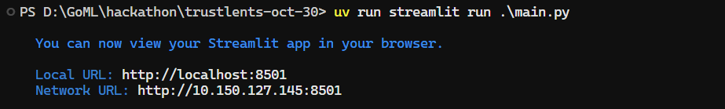
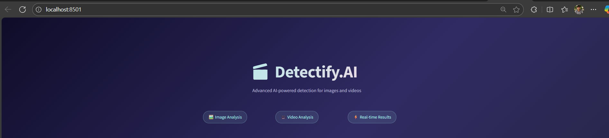
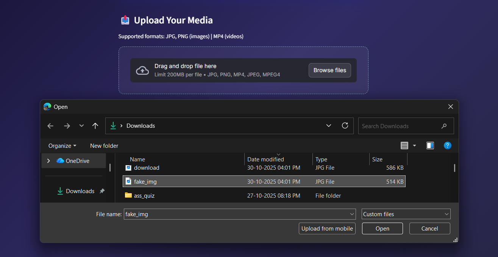
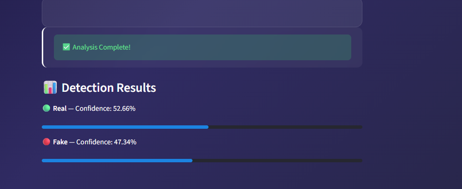

# 🧠 Detectify.AI – Fake Media Detection using Deep Learning

## 🚀 Overview

**Detectify.AI** is an AI-powered application designed to detect whether an uploaded **image** or **video** is *real* or *fake*.
With the rapid growth of generative AI and synthetic media, distinguishing real from fake content has become critical for digital trust and online safety.

This project leverages **Deep Learning models** and **computer vision** techniques to analyze visual cues, facial inconsistencies, and spatio-temporal patterns in videos to accurately detect deepfakes in real time.

---

## 🎯 Problem Statement

Deepfakes can spread misinformation, create reputational damage, and undermine public trust.
The challenge is to build a **robust, scalable, and accurate deepfake detection system** capable of working on both **images** and **videos** uploaded by users.

---

## 🧩 Solution

We built a **web-based application** that:

1. Accepts **image** or **video** uploads.
2. Runs a **deepfake detection model** (EfficientNet / Vision Transformer / RNN-based).
3. Generates a **confidence score** indicating how likely the media is fake.
4. Works in **real time** using GPU-accelerated inference.

---

## ⚙️ Tech Stack

| Category           | Tools/Frameworks                                                       |
| ------------------ | ---------------------------------------------------------------------- |
| **Frontend**       | Streamlit                                                              |
| **Deep Learning**  | PyTorch / TensorFlow                                                   |
| **Models Used**    | EfficientNet, Vision Transformer (ViT)                                 |
| **Storage**        | Local                                                                  |

---

## 🧠 Model Architecture

* **For Images:** pre-trained ViT base family of EfficientNet trained on `deepfake and reali mages` .
* **For Videos:**  EfficientNet-B0 for feature extraction and Transformer-based temporal modeling with classification head

---

## Model Links

* [Image model](https://huggingface.co/dima806/deepfake_vs_real_image_detection)
* [Video model](https://huggingface.co/faisalishfaq2005/deepfake-detection-efficientnet-vit)

## 🏗️ System Architecture


## 💡 Key Features

✅ Detects fake content in both **images** and **videos**
✅ Supports multiple input formats (JPG, PNG, MP4)
✅ Provides **confidence scores** (e.g., “Fake – 87% confidence”)
✅ Simple **web interface** for non-technical users
✅ Modular architecture for easy **model swapping**

---

### Prerequisites
- Git
- Python (3.11 or higher)
- [Astral uv](https://docs.astral.sh/uv/getting-started/installation/) (a fast Python package and project manager, written in Rust)


## 🧰 Installation and setup

### 1️⃣ Clone the Repository

```bash
git clone https://github.com/Rkgoml/trustlens-30-10.git
cd trustlens-30-10
```

### 2️⃣ Run the Application

```bash
uv run streamlit run main.py
```

### 5️⃣ Access the UI

Open your browser at `http://localhost:8501`.

---

## 🧪 Example Usage

### 1️⃣ Start the Streamlit Server
Run the application locally using:



### 2️⃣ Open the App in Your Browser

Once the server starts, Streamlit will display a local URL in the terminal (something like):

Local URL: http://localhost:8501

Open that URL in your browser to access the app.


### 3️⃣ Upload an Image or Video

Select an image (.png / .jpg) or a video (.mp4) from your system and upload it using the Streamlit interface.



### 4️⃣ Click the “Analyze” Button

Once uploaded, click on the Analyze button to start the deepfake detection process.


### 5️⃣ View the Results

After a short processing time, the prediction result and confidence score will be displayed on the screen. 




## ⚡ Future Enhancements

* 🔹 Add **audio-based** deepfake detection
* 🔹 Integrate **transformer-based multimodal models**
* 🔹 Real-time deepfake detection via webcam stream
* 🔹 Support for **mobile app interface**

---

## 🏆 Hackathon Impact

This solution empowers users, media agencies, and fact-checkers to:

* Detect manipulated content early
* Build trust in shared media
* Promote AI safety and responsible AI usage

---

## 📜 License

This project is licensed under the **MIT License** – see the [LICENSE](LICENSE) file for details.


